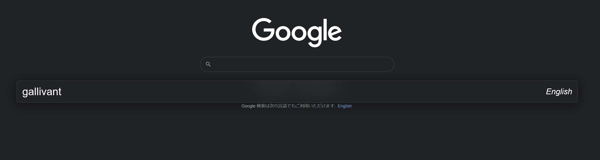

# Gallivant

A simple browser search toolbar that allows you to organize your search engines into groups and quickly access them.

## Keybindings

`ctrl+j/k` to change engines
`ctrl+alt+g` or `ctrl+g` to toggle the search bar



## Building 

### MacOS/Linux

Gallivant is developed using [bun](https://bun.sh/), a new javascript runtime. Make sure it's installed, then run

```shell
bun i # to install dependencies
bun bun:product # to create the extension's zip
```

### Windows

On windows, `bun` currently isn't supported, so make sure to install [Nodejs](https://nodejs.org/en/)
and [pnpm](https://pnpm.js.org/) instead.

```shell
pnpm i
pnpm pnpm:product
```

## Development

```shell
bun i
bun run watch
bun run serve:firefox
```